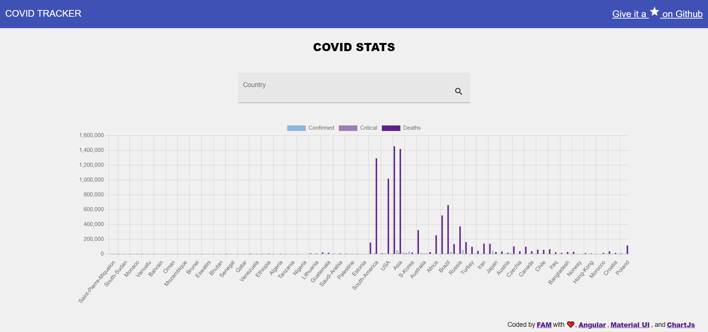

# CovidTracker

Covid tracker app, built with Angular 13, Material UI, RapidAPI Covid Stats and ChartJs.

## [See app online](https://covid-tracker-8dsdedsom-famzila.vercel.app/)

## Requirements
- NodeJS

## Run the app
- `npm install`
- Update the `environement.ts` file  with your API key.
- `npm start`

## Development server

Run `ng serve` for a dev server. Navigate to `http://localhost:4200/`. The application will automatically reload if you change any of the source files.
